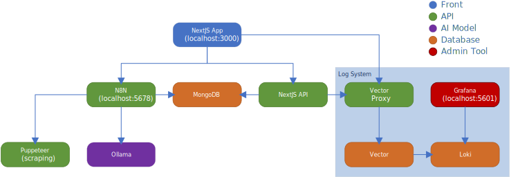
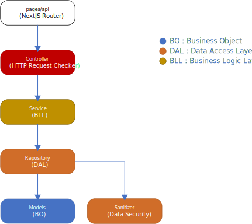
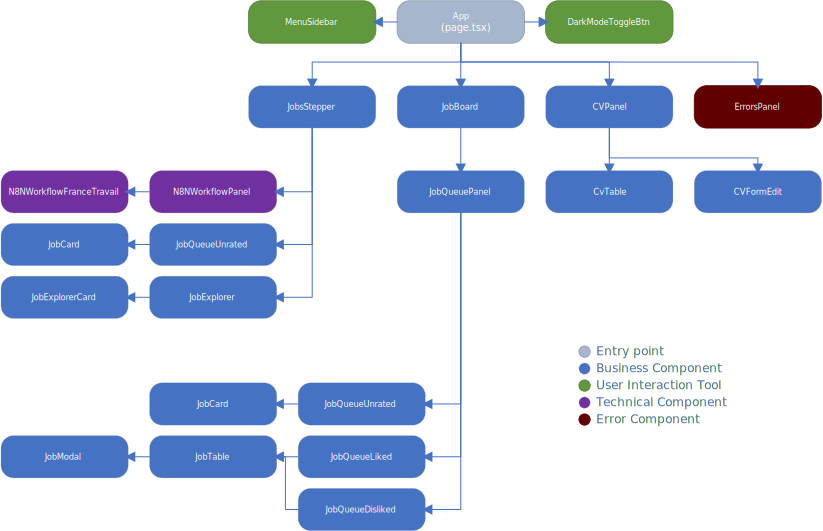

[FR](./README_CODE_FR.md) - [EN]

# Code - Technical Documentation

This project combines:
- A **Backend (API)**: data management, business logic, API routes (Next.js)
- A **Frontend (App)**: web user interface (Next.js/React)

---

## 1. General Architecture



### Backend (API)
- **pages/api/**: Entry point for HTTP requests (Next.js API routes)
- **src/backend/controllers/**: Controllers (validation, request orchestration)
- **src/backend/services/**: Business Logic Layer
- **src/backend/repositories/**: Data Access Layer
- **src/backend/models/**: Business Objects
- **src/backend/lib/**: Backend utilities
- **Sanitizer**: Data security and sanitization (in services/lib)



### Frontend (App)
- **src/app/**: React application (pages, layout, providers, etc.)
- **src/app/components/**: Reusable UI components
- **src/app/store/**: Client-side state management
- **src/interfaces/**, **src/types/**: Shared TypeScript interfaces
- **public/**: Static files (icons, images)



---

## 2. Main Folder Structure

- `web-manager/`: Next.js application (frontend & backend API)
  - `src/app/`: Frontend (UI, pages, components)
  - `src/backend/`: Backend (API, business logic, data access)
  - `src/constants/`: Shared constants
  - `src/interfaces/`, `src/types/`: TypeScript types and interfaces
  - `public/`: Static files
- `http-request-operator/`: Node.js microservice for custom HTTP request handling
- `config/`: Configuration files (nginx, vector, etc.)
- `logo/`: Logos and icons
- `data/db/`: Database initialization scripts

---

## 3. Main Technologies

- **Next.js** (React, API routes)
- **Node.js** (microservices)
- **MongoDB** (database)
- **Docker** (containers, orchestration via `docker-compose.yml`)
- **Nginx** (reverse proxy)

---

## 4. Example HTTP Request Flow (Backend)

1. The user (via the App or an external client) sends a request to an API route (`/api/...`)
2. The controller (`src/backend/controllers/`) validates and processes the request
3. Business logic is applied in the service layer (`src/backend/services/`)
4. Data is retrieved or modified via the repository (`src/backend/repositories/`)
5. Business objects are defined in the models (`src/backend/models/`)
6. Sensitive data is sanitized (in services/lib)
7. A response is sent back to the user

---

## 5. Example Frontend (App) Flow

1. The user accesses the web application (pages in `src/app/`)
2. UI components display data and interact with the user
3. API calls are made via `fetch` to `/api/...`
4. Received data is displayed or used in the interface

---

## 6. Quick Start

1. Prepare the environment configuration:
   - Copy the `.env.local` file to `.env` at the project root
   - Set your own credentials and secrets in `.env` (login, password, API keys, etc.)
2. Make sure [Node.js](https://nodejs.org/) and [Docker](https://www.docker.com/) are installed.
3. Start the application:
    ```sh
    npm run start
    ```
    This script will install and launch all required services via Docker Compose.
