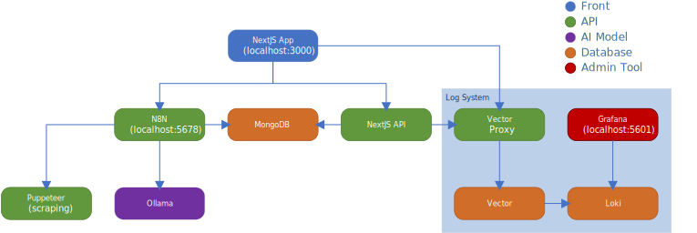

[FR] - [EN](./README_CODE_EN.md)

# Code - Documentation Technique

Ce projet combine :
- Un **Backend (API)** : gestion des données, logique métier, routes API (Next.js)
- Un **Frontend (App)** : interface utilisateur web (Next.js/React)

---

## 1. Architecture Générale




### Backend (API)
- **pages/api/** : Point d'entrée des requêtes HTTP (API routes Next.js)
- **src/backend/controllers/** : Contrôleurs (validation, orchestration des requêtes)
- **src/backend/services/** : Logique métier (Business Logic Layer)
- **src/backend/repositories/** : Accès aux données (Data Access Layer)
- **src/backend/models/** : Modèles de données (Business Objects)
- **src/backend/lib/** : Utilitaires backend
- **Sanitizer** : Sécurité et nettoyage des données (dans services/lib)


### Frontend (App)
- **src/app/** : Application React (pages, layout, providers, etc.)
- **src/app/components/** : Composants UI réutilisables
- **src/app/store/** : Gestion d’état côté client
- **src/interfaces/**, **src/types/** : Interfaces TypeScript partagées
- **public/** : Fichiers statiques (icônes, images)


---

## 2. Organisation des dossiers principaux

- `web-manager/` : Application Next.js (frontend & backend API)
  - `src/app/` : Frontend (UI, pages, composants)
  - `src/backend/` : Backend (API, logique métier, accès aux données)
  - `src/constants/` : Constantes partagées
  - `src/interfaces/`, `src/types/` : Types et interfaces TypeScript
  - `public/` : Fichiers statiques
- `http-request-operator/` : Microservice Node.js pour la gestion des requêtes HTTP personnalisées
- `config/` : Fichiers de configuration (nginx, vector, etc.)
- `logo/` : Logos et icônes
- `data/db/` : Scripts d'initialisation de la base de données

---

## 3. Technologies principales

- **Next.js** (React, API routes)
- **Node.js** (microservices)
- **MongoDB** (base de données)
- **Docker** (conteneurs, orchestration via `docker-compose.yml`)
- **Nginx** (reverse proxy)

---

## 4. Exemple de flux d'une requête HTTP (Backend)

1. L'utilisateur (via l’App ou un client externe) envoie une requête à une route API (`/api/...`)
2. Le contrôleur (`src/backend/controllers/`) valide et traite la requête
3. La logique métier est appliquée dans le service (`src/backend/services/`)
4. Les données sont récupérées ou modifiées via le repository (`src/backend/repositories/`)
5. Les objets manipulés sont définis dans les modèles (`src/backend/models/`)
6. Les données sensibles sont nettoyées par le sanitizer (dans services/lib)
7. Une réponse est renvoyée à l'utilisateur

---

## 5. Exemple de flux côté Frontend (App)

1. L’utilisateur accède à l’application web (pages dans `src/app/`)
2. Les composants UI affichent les données et interagissent avec l’utilisateur
3. Les appels API sont faits via `fetch` vers `/api/...`
4. Les données reçues sont affichées ou utilisées dans l’interface

---

## 6. Démarrage rapide

1. Préparer la configuration d’environnement :
  - Copier le fichier `.env.local` en `.env` à la racine du projet
  - Renseigner des identifiants et secrets personnalisés dans `.env` (login, mot de passe, clés API, etc.)
2. Vérifier que [Node.js](https://nodejs.org/fr) et [Docker](https://www.docker.com/) sont installés.
3. Démarrer l’application :
    ```sh
    npm run start
    ```
    Ce script lance et installe l’ensemble des services nécessaires via Docker Compose.

